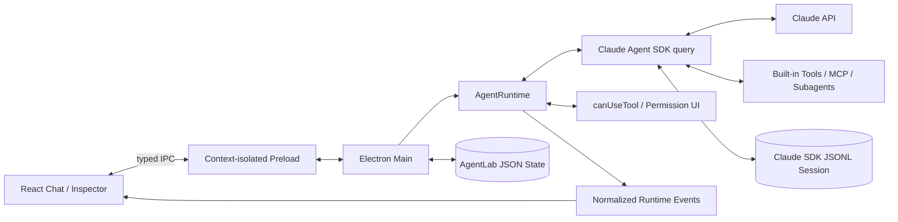

# AgentLab Desktop

AgentLab 是一个基于 Electron、React 和 **Claude Agent SDK** 的本地 Agent 实验台。它不是用普通 Messages API 模拟工具调用，而是直接把 `@anthropic-ai/claude-agent-sdk` 作为运行核心，复用 Claude Code 同源的 Agent Loop、内置工具、上下文管理、Session、权限、Hooks、MCP 和 Subagent 能力。

> 当前版本：MVP `0.1.0`。产品使用独立品牌，不复制 Claude Code 的品牌和视觉资产。

## 已实现能力

- 正常的多会话 Chat 界面与流式文本；
- SDK Session ID 捕获、持久化和 `resume`；
- Read、Glob、Grep、Edit、Write、Bash、WebSearch、WebFetch、Agent 工具开关；
- `default`、`acceptEdits`、`plan`、`dontAsk`、`auto`、`bypassPermissions` 权限模式；
- `canUseTool` 原生授权弹窗：拒绝、仅允许一次、本会话始终允许；
- 模型、Fallback、Effort、Thinking、最大 Turns、最大美元预算；
- Sandbox、文件 Checkpoint、额外工作目录；
- System Prompt、`claude_code` preset、user/project/local 设置来源；
- MCP Server、Subagent、Plugin JSON 实验编辑器；
- JSON Schema 结构化输出；
- Pre/Post Tool、Subagent、Compact、Stop Hooks 观察；
- 原始 SDK 事件、工具输入/结果、运行状态、成本和 Token Usage 检查；
- 下一步 Prompt Suggestion；
- AgentLab 自身会话元数据的原子 JSON 持久化。

## 启动

要求 Node.js 20+。Claude Agent SDK 自带平台对应的 Claude Code 二进制，不需要单独安装 Claude Code。

```bash
npm install
export ANTHROPIC_API_KEY=sk-ant-...
npm run dev
```

SDK 也支持 Bedrock、Vertex、Foundry 等官方认证方式。AgentLab 不会把 API Key 发送到 Renderer，也不会将它写入本地状态文件；SDK 子进程从 Electron Main Process 的环境变量继承认证信息。

## 验证与打包

```bash
npm test
npm run build:web
npm run build
```

`build:web` 会完成 TypeScript、Renderer、Electron Main 和 Preload 构建。`build` 会继续用 electron-builder 生成未签名的本机应用目录。项目使用 Vite 的 `--configLoader runner`，原因是当前环境里 esbuild 的 config bundling 路径会挂起，而 runner 模式不影响应用产物。

## 技术架构



关键边界：

1. Renderer 只负责 UI，不拥有 Node.js 权限，也不接触 API Key。
2. Preload 只暴露固定的类型化 IPC 方法。
3. Main Process 管理窗口、会话元数据和 SDK 生命周期。
4. `AgentRuntime` 将 UI 配置转换为真实 SDK `Options`，并把 `SDKMessage` 归一化为 UI 事件。
5. 工具真正由 SDK/Claude Code 子进程执行；AgentLab 不复刻或旁路 SDK 的 Harness。
6. Claude SDK 持久化完整 JSONL transcript；AgentLab 另存轻量 UI 会话，二者用 `sdkSessionId` 连接。

## 推荐实验

1. 先用 `plan` 模式让 Agent 分析项目，再切到 `default` 实施。
2. 只自动允许 Read/Glob/Grep，观察 Edit/Bash 的 `canUseTool` 请求。
3. 打开 Hook 事件，比较一次文件编辑的 PreToolUse、权限、Tool Result、PostToolUse 顺序。
4. 在 Subagents JSON 中修改 reviewer 的工具和 maxTurns，再让主 Agent 调用它。
5. 配置一个 stdio MCP Server，观察 init 中的连接状态与 MCP 工具事件。
6. 设置低预算或低 maxTurns，观察 SDK 的 `error_max_budget_usd` / `error_max_turns` Result。
7. 打开结构化输出并填 JSON Schema，对比普通 Chat 文本和 `structured_output`。

## 安全说明

- `bypassPermissions` 会显式设置 SDK 要求的 `allowDangerouslySkipPermissions`，意味着跳过权限检查；只应在隔离且可信的实验目录中使用。
- Markdown 渲染会移除脚本、事件属性和危险 URL；新窗口导航仅允许交给系统浏览器处理 HTTP(S)。
- Electron 使用 `contextIsolation: true`、`nodeIntegration: false`、Renderer sandbox 和 CSP。
- 本项目的 Sandbox 开关传给 SDK，但实际安全边界仍取决于操作系统、SDK 版本和你的 MCP/Plugin 实现。

## 目录

```text
electron/main/agent-runtime.ts  SDK options、事件归一化、权限等待与中断
electron/main/session-store.ts  AgentLab UI 会话持久化
electron/main/index.ts          Electron 生命周期与 IPC
electron/preload/index.ts       Renderer 的最小能力桥
src/App.tsx                     Chat、配置实验台与事件观察器
src/shared/types.ts             Main/Preload/Renderer 共用协议
```

## MVP 之后

- 将 SDK `rewindFiles()` 做成 Chat 消息级回退 UI；
- 使用 SDK Session API 展示并导入全部历史 JSONL；
- 增加 Diff Viewer、文件树和内置终端；
- MCP Elicitation、AskUserQuestion 和更多 User Dialog；
- 用 SQLite 保存可查询的归一化事件和实验对比；
- 应用签名、自动更新、崩溃恢复和端到端测试。
