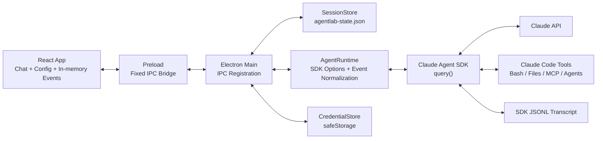
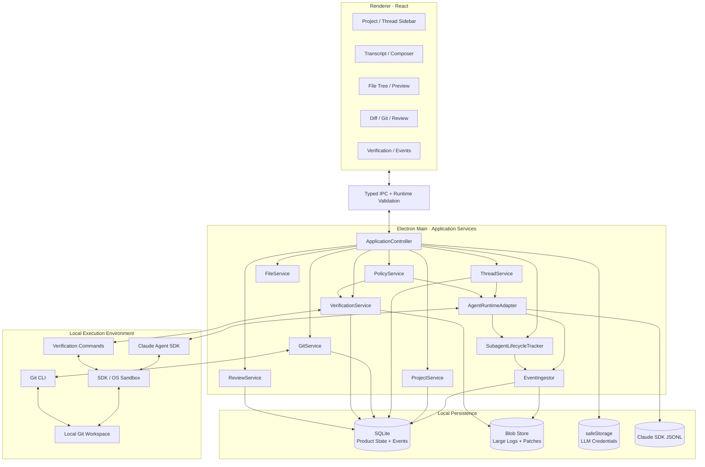
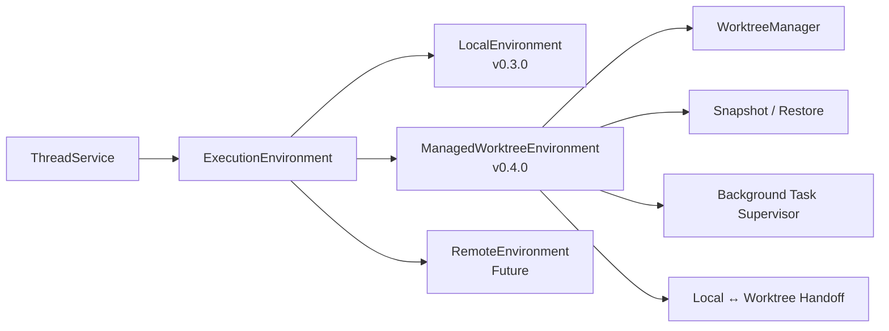
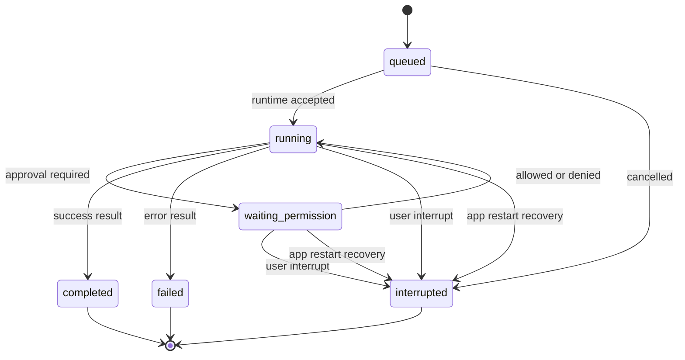
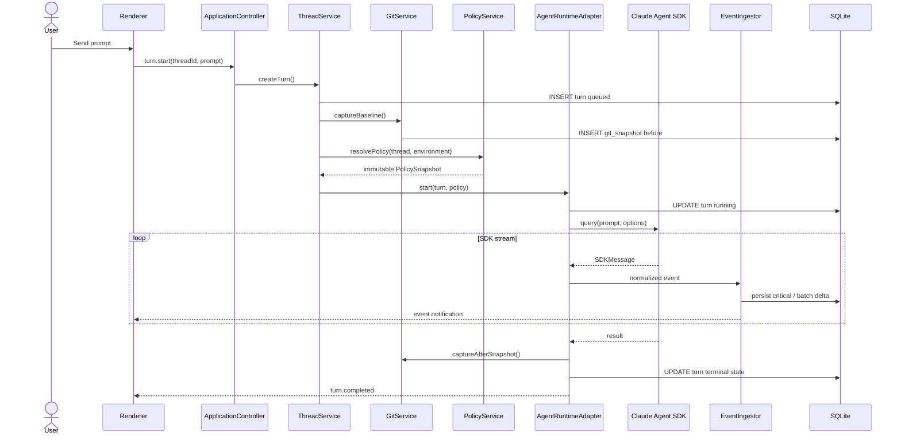
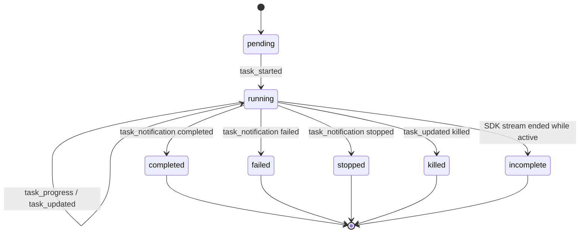
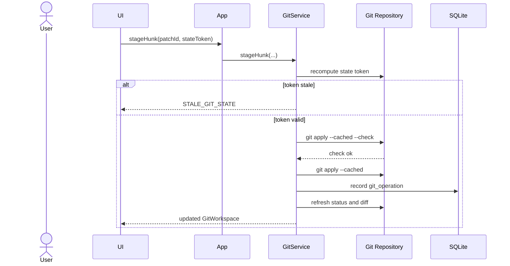
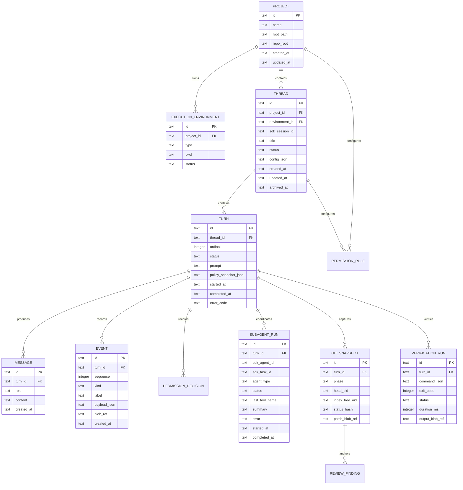
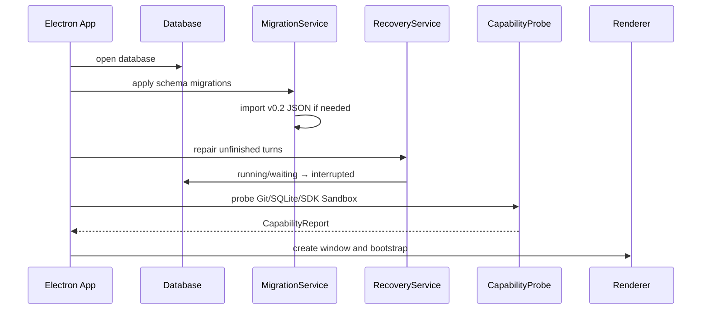
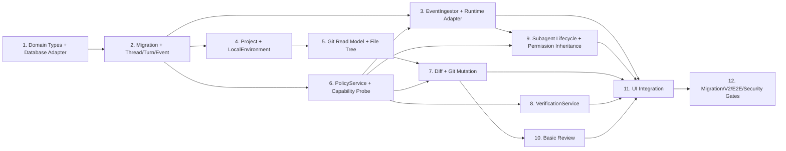

# CodexMVP v0.3.0 技术设计文档

> 文档版本：v1.0
> 编写日期：2026-07-31
> 对应产品版本：CodexMVP / AgentLab v0.3.0
> 配套 PRD：[CodexMVP v0.3.0 详细产品需求 PRD](./CodexMVP-v0.3.0-详细产品需求PRD.md)
> 上游路线图：[CodexMVP 对标 Codex App 产品迭代路线图](./CodexMVP-对标-Codex-App-产品迭代路线图.md)

## 1. 文档目标

本文定义 v0.3.0“安全、可恢复的编码交付闭环”的技术实现，重点回答：

- 如何从 v0.2.0 的 JSON Session 模型迁移到持久化 Thread/Turn/Event；
- 如何在 Electron 中安全地提供 Git 状态、Diff、Stage、Revert 和 Commit；
- 如何把 Claude Agent SDK 的 Sandbox、工具权限和产品审批组合为统一策略；
- 如何保存验证证据、Review Finding 和运行审计；
- 如何为 v0.4.0 Worktree、后台任务和专业 Review 留出架构扩展点。
- 如何修复 V2 实测中的多 Agent 提前结束、子 Agent 权限疑点和版本准入阻塞。

本设计不重新实现 Claude Agent SDK 的 Agent Loop。CodexMVP 继续复用 SDK 提供的模型调用、工具执行、Session Resume、Hooks、MCP 和 Subagent，自己拥有产品状态、Git 工作流、安全策略、验证和 UI 生命周期。

## 2. 设计原则

1. **产品事实优先于模型叙述**：Git 状态、验证退出码和权限决策由本地服务生成，不能由模型文本替代；
2. **默认安全失败**：Sandbox 不可用、路径无法解析或状态已过期时拒绝操作；
3. **状态先落库后广播**：关键生命周期和安全事件持久化成功后再通知 Renderer；
4. **Git 操作必须精确**：使用固定子命令、参数数组、`--` Pathspec 和状态前置条件；
5. **破坏性操作可解释**：执行前解析目标、展示 Diff，并记录确认与结果；
6. **Renderer 零本地权限**：文件、Git、数据库和命令均只在 Electron Main；
7. **能力如实展示**：SDK/OS 无法强制某项 Sandbox 能力时禁用对应预设，不静默降级；
8. **为 v0.4.0 抽象，不提前实现 v0.4.0**：引入 ExecutionEnvironment 接口，但 v0.3.0 只有 Local 实现。

## 3. 官方 Codex 设计映射

本方案借鉴以下公开产品原则，不要求协议或实现与 Codex 一致：

| Codex 官方能力 | v0.3.0 对应设计 |
| --- | --- |
| Review Pane 展示 Unstaged/Staged/Commit/Branch Diff | v0.3.0 先实现 Unstaged、Staged 和基础 Commit Diff |
| 文件/Hunk 级 Stage、Unstage、Revert | GitService 的文件与 Patch 操作 |
| App Server 的 Thread/Turn/Item/Event | Project/Thread/Turn/Event SQLite 模型 |
| `thread/resume`、`turn/interrupt` | SDK Resume + 本地 Turn 状态恢复和中断 |
| Sandbox 与 Approval Policy 分离 | SandboxProfile + ApprovalPolicy + PermissionRule |
| OS 强制 Sandbox、网络默认关闭 | Claude SDK Sandbox 配置、`failIfUnavailable: true`、默认无网络域名 |
| Worktree 隔离并行任务 | v0.3.0 仅提供 ExecutionEnvironment 接口，v0.4.0 实现 Worktree |
| V2 测试暴露的 Harness 缺口 | SubagentLifecycleTracker、agentID 权限白名单、终态门禁和固定回归 Fixture |

参考：[Code Review](https://learn.chatgpt.com/docs/code-review)、[App Server](https://learn.chatgpt.com/docs/app-server)、[Agent Approvals & Security](https://learn.chatgpt.com/docs/agent-approvals-security)、[Worktrees](https://learn.chatgpt.com/docs/environments/git-worktrees)。

## 4. 不同版本技术架构区别

### 4.1 v0.2.0 当前架构



v0.2.0 的限制：

- `LabSession` 同时承担产品会话、运行状态、消息和配置；
- Event 在 Renderer 内存保存，最多保留当前会话最近事件；
- JSON 文件每次更新整体重写，不适合大量事件和查询；
- Git 只能由 Agent 通过 Bash 间接操作；
- Sandbox 是布尔值，审批和工具列表没有统一策略模型；
- 应用异常退出时 `running` 状态缺少确定的恢复语义。

### 4.2 v0.3.0 目标架构



关键变化：

- 从“Main 直接连接 Store/Runtime”变成应用服务层；
- 从整体 JSON 文件变成可迁移、可分页、可事务化的 SQLite；
- Git、文件、验证、Review 成为独立服务，不由 Renderer 或模型任意执行；
- Event 先进入 EventIngestor 持久化，再流向 UI；
- Sandbox Profile、Approval Policy 和 Rule Matcher 统一由 PolicyService 生成；
- 大日志和大 Patch 外置，数据库只保存摘要、Hash 和引用。

### 4.3 v0.4.0 预留架构



v0.3.0 不创建 Worktree，但所有 Turn 都保存 `environmentId`，文件/Git/验证服务都从 Environment 解析 `cwd`。这样 v0.4.0 无需重写 Thread 和 Event 模型。

### 4.4 版本差异总表

| 技术维度 | v0.2.0 | v0.3.0 | v0.4.0 |
| --- | --- | --- | --- |
| 状态存储 | 单个 JSON | SQLite + Blob Store | SQLite + Worktree/Snapshot 元数据 |
| 会话模型 | LabSession | Project/Thread/Turn/Event | 父子 Thread、Fork、Compact、Steer |
| 执行环境 | 单一本地 cwd | LocalEnvironment 抽象 | Local + Managed Worktree +后台 Supervisor |
| Git | Agent Bash | GitService + Diff/Patch/Commit | Branch/Handoff/Worktree 生命周期 |
| 安全 | SDK Sandbox Boolean | Profile + Approval + Rules + Capability Probe | 按 Environment 独立策略与后台审批 |
| 验证 | Bash 输出混在事件 | VerificationRun 结构化证据 | Worktree/Commit 级验证矩阵 |
| Review | Reviewer Subagent 实验 | 当前未提交变更的基础只读 Review | 多范围、独立 Thread、行内协作 |
| 多 Agent | 能启动，完成和权限继承不可靠 | 子任务终态聚合、前台约束、agentID 权限白名单 | 隔离并行、跨 Thread 协调 |
| 恢复 | SDK Resume + JSON | 数据库恢复，异常运行标记 interrupted | 后台任务重连、快照恢复 |

## 5. 模块设计

### 5.1 ApplicationController

职责：

- 作为 IPC Handler 的唯一入口；
- 验证 Renderer 输入并调用具体服务；
- 组合 Project、Thread、Git、Policy 和 Verification 返回 View Model；
- 不包含 Git 命令、数据库 SQL 或 Claude SDK 细节。

建议目录：

```text
electron/main/
  application/
    application-controller.ts
    ipc-schemas.ts
  domain/
    project.ts
    thread.ts
    turn.ts
    event.ts
    git.ts
    policy.ts
    verification.ts
  services/
    project-service.ts
    thread-service.ts
    git-service.ts
    file-service.ts
    policy-service.ts
    verification-service.ts
    review-service.ts
    subagent-lifecycle-tracker.ts
  runtime/
    agent-runtime-adapter.ts
    event-ingestor.ts
    sdk-message-normalizer.ts
  persistence/
    database.ts
    migrations/
    repositories/
    blob-store.ts
  execution/
    execution-environment.ts
    local-environment.ts
    process-runner.ts
```

### 5.2 ProjectService

职责：

- 规范化用户选择目录；
- 使用 `git rev-parse --show-toplevel` 识别仓库根；
- 维护 Project 与 LocalEnvironment；
- 读取 Project 级安全和验证配置；
- 不主动访问远端网络。

Project Identity 使用仓库真实路径的规范化值生成稳定 ID。移动目录后作为新 Project，由后续“重新关联”功能处理。

### 5.3 ThreadService

职责：

- 创建、更新、归档和删除 Thread；
- 创建 Turn 并驱动状态机；
- 管理 SDK Session ID 引用；
- 在应用启动时修复未完成 Turn；
- 提供分页消息和事件查询。

状态机：



不允许从终态恢复同一个 Turn。用户“继续”时创建新 Turn，并复用 Thread 的 SDK Session。

### 5.4 AgentRuntimeAdapter

由现有 `AgentRuntime` 演进，职责限定为：

- 将 Turn、AgentConfig、PolicySnapshot 转换为 SDK Options；
- 启动、中断和清理 `query()`；
- 将 SDK Message 交给 `SdkMessageNormalizer`；
- 将权限请求转发 PolicyService/ApplicationController；
- 保证 `turnId + runGeneration` 隔离迟到事件。
- 将 SDK Task/Background Task 消息交给 SubagentLifecycleTracker；
- 在 SDK 流结束时执行“无活动子任务”终态门禁。

不再直接写 Session JSON，也不直接广播 Renderer。

运行关键路径：



### 5.5 EventIngestor

事件分两类：

#### Critical Events

- Turn 状态变化；
- 用户和 Assistant 完整消息；
- Tool Use/Result；
- Permission Request/Decision；
- Error/Result；
- Verification Start/Complete；
- Git Mutation；
- Review Finding。

Critical Event 在 UI 广播前完成事务提交。

#### High-frequency Events

- Assistant text delta；
- Thinking delta；
- 命令输出 delta。

High-frequency Event 在内存按 `turnId + streamId` 合并，每 100-250ms 批量写入；Turn 结束或应用退出前 Flush。完整最终消息仍作为 Critical Event 保存。

单个 Event Payload 超过 64KB 时写入 Blob Store，Event 保存 `blobRef`、字节数和 SHA-256。

### 5.6 SubagentLifecycleTracker

V2 TC-10 已确认：v0.2.0 能启动三个专家，但主任务会在专家全部完成前结束，且只读专家出现 Bash 迹象。v0.3.0 必须把 SDK 子任务消息从通用 `system` Event 提升为一等状态。

#### 输入消息

- `task_started`：创建 SubagentRun；
- `task_progress`：更新摘要、最后工具和 Usage；
- `task_updated`：合并 SDK 状态 Patch；
- `task_notification`：写入 completed/failed/stopped 终态和结果引用；
- `background_tasks_changed`：使用 Replace 语义替换活动任务集合；
- `SubagentStart/SubagentStop` Hook：补充 Agent 类型和生命周期审计；
- `canUseTool(..., { agentID })`：执行子 Agent 工具白名单。

#### 状态模型



#### 完成门禁

主 Turn 收到 SDK Result 后不立即宣告产品成功，而是检查：

1. `background_tasks_changed` 最新活动集合为空；
2. 已创建的非 ambient SubagentRun 均进入终态；
3. 不存在未处理的子 Agent 越权拒绝；
4. 最终汇总包含所有 completed 结果，并列出 failed/stopped 子任务。

若 SDK Iterator 已结束但仍有活动子任务，Turn 以 `SUBAGENT_INCOMPLETE` 失败关闭。v0.3.0 不伪造等待已经不存在的 SDK 进程。

#### 前台执行约束

为消除 v0.3.0 中不可恢复的后台遗留任务，配置型 Reviewer/专家的 Agent 工具输入统一设置 `run_in_background: false`。通过 PreToolUse Hook 与 `canUseTool.updatedInput` 双重规范化；SDK 不支持修改时拒绝后台调用并要求前台重试。

#### 权限继承

`canUseTool` 的 `agentID` 映射到 SubagentRun 和 `AgentDefinition.tools`。有效工具集为：

```text
effectiveSubagentTools = configuredAgentTools ∩ mainTurnAllowedTools ∩ sandboxCapabilities
```

任何不在有效集合内的工具直接返回 deny，不弹出“允许一次”升级只读专家权限。拒绝记录包含 agentID、agentType、toolName、toolUseID 和原因。

#### 产品阶段汇总

Tracker 持续计算：

```ts
interface SubagentRollup {
  total: number
  running: number
  completed: number
  failed: number
  stopped: number
  summaries: Array<{ agentId: string; name: string; status: string; lastStep?: string }>
}
```

Renderer 将其展示为“启动 3 个专家 · 完成 2 · 失败 1”，原始 SDK Event 保留在审计视图。

### 5.7 GitService

#### 进程规则

- 使用 `node:child_process.spawn`；
- `shell: false`；
- 命令固定为解析出的 Git 可执行文件；
- 参数使用字符串数组；
- 路径参数前使用 `--`；
- `cwd` 必须来自 ExecutionEnvironment；
- 清理 LLM 和应用敏感环境变量；
- 设置超时、输出上限和 AbortSignal；
- 保存 Exit Code、stderr 摘要和操作审计。

#### 读取操作

| 能力 | 建议命令 |
| --- | --- |
| 仓库根 | `git rev-parse --show-toplevel` |
| HEAD | `git rev-parse HEAD`，无初始 Commit 时特殊处理 |
| 分支 | `git symbolic-ref --short -q HEAD` |
| 状态 | `git status --porcelain=v2 -z --branch` |
| Unstaged Diff | `git diff --no-ext-diff --binary --` |
| Staged Diff | `git diff --cached --no-ext-diff --binary --` |
| Commit Diff | `git show --format= --no-ext-diff <oid> --` |

禁用外部 Diff Driver 和分页器，避免执行仓库配置中的外部程序。运行环境设置：

```text
GIT_PAGER=cat
PAGER=cat
GIT_OPTIONAL_LOCKS=0（只读操作）
```

#### 修改操作

- 文件 Stage：`git add -- <path>`；
- 文件 Unstage：已有 HEAD 时使用 `git restore --staged -- <path>`，Unborn Branch 使用独立兼容路径；
- Hunk Stage：从当前 Diff 生成最小 Patch，通过 stdin 传给 `git apply --cached --check`，校验后再 `git apply --cached`；
- Hunk Unstage：对 Staged Diff 生成反向 Patch，先 Check 后 Apply；
- 文件 Revert：Tracked 文件使用 `git restore --worktree -- <path>`；
- Hunk Revert：对当前 Unstaged Diff 生成反向 Patch并先 Check；
- Untracked 删除：不调用 Git，通过 FileService 删除精确文件，必须单独确认；
- Commit：`git commit -m <message>`，不得自动增加 `--no-verify`。

#### 乐观并发控制

每次 Diff 返回 `GitStateToken`：

```ts
interface GitStateToken {
  headOid: string | null
  indexTreeOid: string | null
  statusHash: string
  generatedAt: number
}
```

Stage/Revert/Commit 前重新生成 Token。若与 UI 操作携带的 Token 不一致，返回 `STALE_GIT_STATE`，不执行修改，并要求刷新。

Git 操作序列：



### 5.8 FileService

- 所有路径先 `resolve`，再 `realpath`；
- 检查真实路径位于 Project 根或明确允许的只读根；
- 符号链接本身可展示，但读取目标前执行边界检查；
- 目录列表分页/懒加载；
- 默认根据 Git Ignore 结果过滤，而不是自己重新实现完整 Ignore 语义；
- 文本预览限制默认 1MB；
- 二进制通过 NUL/编码检测降级为元数据；
- v0.3.0 Renderer 只获得文本内容或结构化元数据，不获得任意本地文件 URL。

### 5.9 PolicyService

策略由三个正交部分组成：

```ts
interface PolicySnapshot {
  sandboxProfile: 'read-only' | 'workspace-write' | 'full-access'
  approvalPolicy: 'on-request' | 'never'
  readableRoots: string[]
  writableRoots: string[]
  network: { mode: 'deny' | 'allowlist'; domains: string[] }
  toolPolicy: Record<string, 'allow' | 'ask' | 'deny'>
  commandRules: CommandRule[]
  capabilityReport: SandboxCapabilityReport
}
```

#### 与 Claude Agent SDK 的映射

当前 SDK 类型已经提供：

- `sandbox.enabled`；
- `sandbox.failIfUnavailable`；
- `sandbox.filesystem.allowRead/allowWrite/denyRead/denyWrite`；
- `sandbox.network.allowedDomains/deniedDomains`；
- `sandbox.credentials`；
- `canUseTool` 权限回调。

v0.3.0 映射：

| Profile | SDK Sandbox | 文件策略 | 网络 | Approval |
| --- | --- | --- | --- | --- |
| Read-only | enabled + fail closed | Project 可读，禁止写 | 默认 deny | 写入/命令变更直接 deny |
| Workspace-write | enabled + fail closed | Project 可读写，其他根按配置 | 默认 deny，可 Allowlist | 越界或 Ask Rule 请求用户 |
| Full-access | filesystem isolation 关闭或 Sandbox 关闭 | 不限制 | 仍按用户网络设置 | 默认 on-request，不等于绕过审批 |

`Full-access` 与 `bypassPermissions` 不再是同义词。前者描述 Sandbox 边界，后者描述是否跳过审批；v0.3.0 UI 不默认暴露“无 Sandbox + 无审批”的组合。

#### Capability Probe

应用启动和切换 Profile 时执行能力探测：

- SDK 是否支持目标 Sandbox 字段；
- 当前平台依赖是否可用；
- 文件系统隔离是否成功；
- 网络隔离是否可用；
- 凭据 Scrub 是否启用。

若 Workspace-write 的强制隔离不可用：

- 禁止开始写任务；
- 可降级为 Read-only；
- UI 明确展示缺失能力和诊断信息；
- 不得设置 `failIfUnavailable: false` 后静默继续。

#### CommandRule

```ts
interface CommandRule {
  id: string
  scope: 'thread' | 'project' | 'global'
  executable: string
  argvPrefix: string[]
  cwdRoot?: string
  behavior: 'allow' | 'ask' | 'deny'
  createdAt: number
  enabled: boolean
}
```

规则匹配规范化后的可执行文件和参数前缀，不保存可执行任意 Shell 的正则。包含管道、重定向、子 Shell 或命令替换的 Bash 字符串不能自动生成持久 Allow Rule，只能允许一次或继续询问。

### 5.10 VerificationService

职责：

- 从 `package.json` 发现 `test`、`lint`、`build`、`typecheck` 等脚本；
- 将用户选择转换为固定 `CommandSpec`；
- 通过 ProcessRunner 和 PolicyService 执行；
- 流式输出并保存 VerificationRun；
- 为完成页计算 `passed/failed/not_run`。

```ts
interface CommandSpec {
  executable: string
  args: string[]
  cwd: string
  source: 'discovered' | 'custom'
  timeoutMs: number
}
```

不使用 `exec("npm test")`。发现脚本时生成类似 `{ executable: npmPath, args: ['run', 'test'] }` 的参数化调用。自定义复杂 Shell 命令必须走 Bash 权限流程。

### 5.11 ReviewService

v0.3.0 只支持当前工作区未提交修改：

1. GitService 生成稳定 Diff Snapshot；
2. ReviewService 创建只读 Reviewer Run；
3. Reviewer 工具限制为 Read/Glob/Grep，加 Git 只读上下文；
4. 使用 JSON Schema 输出 `ReviewFinding[]`；
5. 校验文件路径位于项目内、行号存在、严重度合法；
6. Finding 与 `gitSnapshotId` 关联；
7. 用户请求修复时，把选中 Finding 作为新 Turn 输入。

若 GitStateToken 已变化，旧 Finding 标记为 `outdated`，但保留审计记录。

## 6. 数据设计

### 6.1 SQLite 选择

建立 `DatabaseAdapter` 接口，首选 Electron 所带 Node Runtime 的 `node:sqlite`。实现前必须在开发和打包后的目标平台验证模块可用；若不满足，再通过 ADR 切换到 `better-sqlite3`，并增加原生模块 Rebuild 与打包验证。

数据库配置：

- WAL Mode；
- Foreign Keys ON；
- Busy Timeout；
- 事务化 Migration；
- Prepared Statements；
- 数据库文件权限仅当前用户可读写。

### 6.2 实体关系图



### 6.3 关键索引

- `turn(thread_id, ordinal)` unique；
- `turn(status, started_at)`；
- `event(turn_id, sequence)` unique；
- `event(turn_id, kind, created_at)`；
- `message(turn_id, created_at)`；
- `verification_run(turn_id, created_at)`；
- `subagent_run(turn_id, status, started_at)`；
- `subagent_run(sdk_agent_id)` 和 `subagent_run(sdk_task_id)`；
- `review_finding(git_snapshot_id, severity)`；
- `thread(project_id, archived_at, updated_at)`。

### 6.4 数据保留

- Thread/Turn/关键 Event 默认保留，直到用户删除 Thread；
- Streaming Delta 可在形成完整 Message 后压缩或清理；
- 单条验证/命令日志超过 1MB 外置；
- Blob Store 使用内容 Hash 命名并记录引用；
- 删除 Thread 时事务删除数据库引用，再清理无引用 Blob；
- SDK JSONL Transcript 不由数据库级联删除，UI 必须说明并提供后续清理入口。

## 7. IPC 设计

Renderer API 从“Session CRUD”演进为按领域分组的能力：

```ts
interface AgentLabApiV3 {
  app: {
    load(): Promise<AppBootstrap>
    capabilities(): Promise<CapabilityReport>
  }
  projects: {
    open(path: string): Promise<ProjectView>
    list(): Promise<ProjectSummary[]>
  }
  threads: {
    create(projectId: string): Promise<ThreadView>
    list(query: ThreadQuery): Promise<Page<ThreadSummary>>
    read(threadId: string): Promise<ThreadView>
    archive(threadId: string): Promise<void>
  }
  turns: {
    start(threadId: string, prompt: string): Promise<TurnView>
    interrupt(turnId: string): Promise<void>
    events(turnId: string, cursor?: string): Promise<Page<RuntimeEvent>>
  }
  git: {
    status(projectId: string): Promise<GitWorkspaceView>
    diff(request: DiffRequest): Promise<DiffView>
    stage(request: PatchOperationRequest): Promise<GitWorkspaceView>
    unstage(request: PatchOperationRequest): Promise<GitWorkspaceView>
    revert(request: ConfirmedPatchOperation): Promise<GitWorkspaceView>
    commit(request: CommitRequest): Promise<CommitResult>
  }
  verification: {
    discover(projectId: string): Promise<VerificationCommand[]>
    run(threadId: string, commandId: string): Promise<VerificationRun>
    interrupt(runId: string): Promise<void>
  }
  review: {
    start(threadId: string, gitStateToken: string): Promise<ReviewRun>
    findings(reviewRunId: string): Promise<ReviewFinding[]>
  }
  policy: {
    get(projectId: string): Promise<PolicyView>
    update(projectId: string, patch: PolicyPatch): Promise<PolicyView>
    resolve(requestId: string, decision: PermissionDecision): Promise<void>
  }
}
```

所有 IPC Payload 使用运行时 Schema 校验。TypeScript 类型不能代替运行时验证。

事件通知至少包含：

- `thread.updated`；
- `turn.updated`；
- `turn.event.appended`；
- `permission.requested`；
- `git.workspace.changed`；
- `verification.updated`；
- `review.updated`。
- `subagent.updated` 和 `subagent.rollup.updated`。

通知只携带 ID 和必要增量，大列表由 Renderer 分页拉取。

## 8. 启动、迁移与恢复

### 8.1 启动顺序



### 8.2 v0.2 JSON 迁移

1. 检测 `agentlab-state.json` 且数据库没有 `legacy_import_v1` 标记；
2. 复制为带时间戳的只读备份；
3. 在单个事务中创建默认 Project/Environment，并逐个导入 LabSession；
4. 每条 ChatMessage 映射为 Message；无法可靠还原的 Turn 以 `legacy` 事件保存；
5. 保存 AgentConfig JSON 和 SDK Session ID；
6. 提交事务后写入 Migration 标记；
7. 保留原 JSON，不立即删除；
8. 任意失败则回滚事务、保留原文件并启动只读诊断页。

迁移必须幂等，多次启动不得重复导入。

### 8.3 异常运行恢复

应用启动时，将数据库中 `queued/running/waiting_permission` 的 Turn 标记为 `interrupted`，写入 `client_restart` Event。v0.3.0 不声称可以重新连接已经退出的 Claude 子进程；用户继续时创建新 Turn 并尝试通过 SDK Session Resume 延续上下文。

## 9. UI 状态与缓存

- Zustand 只保存当前 View State 和分页缓存，不再是事件事实来源；
- 当前 Thread 的消息、Turn 和 Event 从 Main 查询；
- 收到通知后按 ID 更新或增量获取；
- Git Diff 使用 `GitStateToken`，状态变化后自动标记旧 Diff 为过期；
- Permission Dialog 绑定 `requestId + turnId`，过期请求自动关闭；
- 切换 Thread 不取消后台数据库写入，但 v0.3.0 同一 Thread 只允许一个 Active Turn；
- 不同 Thread 是否允许并行 Agent Run 保持现有能力，但共享 Local 工作区时 UI 显示冲突风险；正式隔离并行留到 v0.4.0。

## 10. 错误模型

统一错误：

```ts
interface AppError {
  code: string
  message: string
  retryable: boolean
  details?: Record<string, unknown>
  causeRef?: string
}
```

关键错误码：

- `NOT_A_GIT_REPOSITORY`；
- `STALE_GIT_STATE`；
- `GIT_CONFLICT`；
- `GIT_IDENTITY_MISSING`；
- `SANDBOX_UNAVAILABLE`；
- `PATH_OUTSIDE_ALLOWED_ROOTS`；
- `NETWORK_DENIED`；
- `PERMISSION_REQUEST_EXPIRED`；
- `TURN_ALREADY_RUNNING`；
- `DATABASE_MIGRATION_FAILED`；
- `VERIFICATION_TIMEOUT`；
- `REVIEW_SNAPSHOT_OUTDATED`。

UI 不直接显示原始 Stack；Stack 和详细 stderr 进入诊断日志，用户看到可操作说明。

## 11. 测试设计

### 11.1 单元测试

- Git porcelain v2 Parser；
- Unified Diff Parser 与 Hunk Patch 生成；
- GitStateToken；
- 路径规范化、真实路径和符号链接边界；
- CommandRule 规范化和匹配；
- Turn 状态机；
- SDK Message → Event 映射；
- JSON → SQLite 迁移；
- Review Finding Schema 和行号校验；
- 验证命令发现。
- SDK Task Message → SubagentRun 状态映射；
- agentID 工具白名单与前台执行输入规范化。

### 11.2 集成测试

每个测试使用临时 Git 仓库，禁止使用真实项目目录：

- Unborn Branch；
- 新增/修改/删除/重命名；
- 部分 Stage；
- 同文件 Staged + Unstaged；
- Hunk Stage/Unstage/Revert；
- Git Hook 失败；
- 外部修改造成 Stale Token；
- 大 Diff 和二进制文件；
- Read-only/Workspace-write 越权；
- Sandbox 不可用时 Fail Closed；
- SQLite 写入中断与 WAL 恢复。
- SDK Result 到达时仍有活动子任务；
- `background_tasks_changed` 丢边事件后的 Replace 恢复；
- 只读子 Agent 请求 Bash/Edit/Write/Web 工具时强制拒绝。

### 11.3 E2E 测试

核心 E2E：

```text
打开 Fixture 仓库
→ 创建 Thread
→ Agent 修改两个文件
→ 查看 Diff
→ Revert 一个 Hunk
→ 运行测试
→ Stage 剩余变更
→ 创建 Commit
→ 强制退出并重启
→ 确认 Thread、事件、验证和 Commit 仍可见
```

V2 回归 E2E：

```text
配置三个只读专家
→ 启动同一审查任务
→ 观察三个 SubagentRun
→ 验证所有任务进入终态
→ 验证主 Turn 最后完成并产生汇总
→ 验证 Bash/Edit/Write/Web 越权执行数为 0
→ 连续执行 10 次
```

### 11.4 安全测试

- Path Traversal、绝对路径和符号链接逃逸；
- Git 参数注入和以 `-` 开头的文件名；
- Shell 控制符规则提升；
- 敏感环境变量泄漏到验证命令；
- 恶意仓库 Git Config、外部 Diff Driver、Pager 和 Hook；
- MCP/Plugin 子进程继承凭据；
- Renderer 伪造 IPC Payload；
- 大 Payload 导致内存或数据库膨胀。
- 伪造 agentID、未知 agentID 和子 Agent 权限升级建议。

## 12. 可观察性

本地结构化日志至少包含：

- App 启动、版本、平台和 CapabilityReport；
- Migration 版本和结果；
- Turn 状态变化，不默认记录完整 Prompt；
- Git 操作类型、目标数量、耗时和结果；
- Permission Rule 命中与决策；
- Verification 命令 ID、耗时和退出码；
- 数据库慢查询和 Event Batch 大小；
- Sandbox 启动失败和降级阻止。

日志默认不包含 API Key、Authorization Header、完整环境变量或未脱敏凭据。产品统计与外部遥测不属于 v0.3.0 范围。

## 13. 实施顺序

不按人力和工期排期，按技术依赖顺序实施：



每一步必须满足：类型检查、单元测试、对应集成测试通过后再进入下一步。AI 实现不改变依赖关系，也不能跳过破坏性 Git 与迁移测试。

## 14. ADR 清单

实现过程中需新增并提交以下 ADR：

1. `ADR-001 SQLite runtime and packaging`；
2. `ADR-002 Git CLI and patch strategy`；
3. `ADR-003 Sandbox profile mapping and fail-closed behavior`；
4. `ADR-004 Event batching and blob retention`；
5. `ADR-005 Legacy JSON migration`；
6. `ADR-006 Review runtime and finding schema`。
7. `ADR-007 Subagent lifecycle and permission inheritance`。

## 15. 发布与回滚

### 15.1 数据兼容

- v0.3.0 首次启动导入 v0.2.0 JSON；
- 导入后继续保留原 JSON 备份；
- v0.2.0 不认识 SQLite，因此版本回退时只能读取旧备份，不应继续写入同一状态；
- 发布说明必须明确 v0.3.0 新增数据目录文件及回退限制。

### 15.2 应用包交付

- 构建输出到独立候选目录，例如 `release-v0.3.0-candidate/`；
- 不覆盖用户正在使用的旧 `.app`；
- 检查候选包 `Contents/Info.plist`；
- 检查 `Contents/MacOS/AgentLab` 主可执行文件；
- 在候选包中执行一次 JSON 迁移、Git Fixture 和 Sandbox Smoke Test；
- 执行 V2 TC-05、TC-07、TC-08 回归和 TC-10 连续 10 次测试；
- 未经用户确认不删除旧包或替换现有应用。

## 16. 明确拒绝的方案

| 方案 | 拒绝原因 |
| --- | --- |
| 继续把所有状态写入一个 JSON | 事件规模、查询、事务和恢复能力不足 |
| Renderer 直接调用 Git 或读取文件 | 破坏 Electron 安全边界，难以统一校验和审计 |
| 让 Agent 自己执行 Stage/Revert/Commit | 用户无法区分模型行为与明确的产品操作，风险过高 |
| 所有 Git 操作都使用 Shell 字符串 | 存在命令注入、转义和平台差异 |
| Sandbox 不可用时自动关闭 Sandbox | UI 安全承诺失真，应 Fail Closed |
| v0.3.0 同时实现 Worktree | 基础状态、Git 和安全能力尚未稳定，会扩大故障面 |
| 复制 Codex App Server 全部协议 | 当前范围不需要，且会把实现复杂度提前引入 |

## 17. References

- [Codex Code Review](https://learn.chatgpt.com/docs/code-review)
- [Codex App Server](https://learn.chatgpt.com/docs/app-server)
- [Codex Agent Approvals & Security](https://learn.chatgpt.com/docs/agent-approvals-security)
- [Codex Configuration Reference](https://learn.chatgpt.com/docs/config-file/config-reference)
- [Codex Worktrees](https://learn.chatgpt.com/docs/environments/git-worktrees)
- [CodexMVP v0.3.0 详细产品需求 PRD](./CodexMVP-v0.3.0-详细产品需求PRD.md)
- [CodexMVP 对标 Codex App 产品迭代路线图](./CodexMVP-对标-Codex-App-产品迭代路线图.md)
- [AgentLab MVP 测试方案 V2－测试结果](./AgentLab-MVP-测试方案-V2-测试结果.md)
